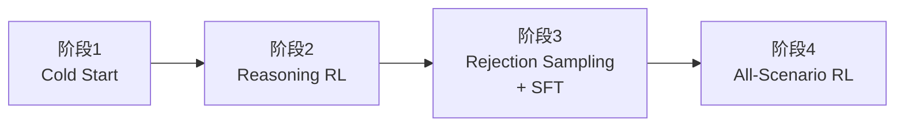

# DeepSeek-R1: Incentivizing Reasoning Capability in LLMs via Reinforcement Learning

> **论文链接**：https://arxiv.org/abs/2501.12948
> **机构**：DeepSeek
> **定位**：Post-Training 领域标杆论文，提出 GRPO 算法和四阶段训练范式

---

## 1. 概述

DeepSeek-R1 是首个通过**纯强化学习（RL）**在 base model 上激发推理能力的开源工作。论文提出两个模型：

| 模型 | 训练方式 | 特点 |
|:---:|:------:|:---:|
| R1-Zero | Base Model + 纯 RL | 无需 SFT，自发涌现推理行为 |
| R1 | Cold Start + 四阶段 Pipeline | 可读性更好，性能更强 |

此外，通过蒸馏将推理能力迁移到 1.5B~70B 小模型，效果优于小模型直接 RL。

---

## 2. 核心算法：GRPO

> GRPO（Group Relative Policy Optimization）：省掉 critic model，用 group 内 reward 做 baseline。

**流程**：
1. 对每个问题 q，从旧策略采样 G 个输出
2. 计算每个输出的 reward，在 group 内标准化得到 advantage
3. 用 clipped PPO 目标 + KL 惩罚优化 policy

**Advantage 计算**：

$$A_i = \frac{r_i - \text{mean}(\{r_1, ..., r_G\})}{\text{std}(\{r_1, ..., r_G\})}$$

**优化目标**：

$$\mathcal{J} = \mathbb{E}\left[\frac{1}{G}\sum_{i=1}^{G}\left(\min\left(\frac{\pi_\theta}{\pi_{\theta_{old}}} A_i,\ \text{clip}(\cdot) A_i\right) - \beta \cdot D_{KL}\right)\right]$$

**核心优势**：不需要与 policy 同等大小的 critic model → **训练显存减半**。

---

## 3. 训练 Pipeline

| 阶段 | 输入 | 做什么 | 输出 |
|:---:|:---:|:-----:|:---:|
| 1. Cold Start | V3-Base + 数千条长 CoT | Fine-tune base model | RL 起点 checkpoint |
| 2. Reasoning RL | 阶段1 checkpoint | GRPO 训练（数学/代码/科学/逻辑） | 推理能力 checkpoint |
| 3. Rejection Sampling + SFT | 阶段2 checkpoint | 采样正确答案(~600k) + 非推理数据(~200k) → 重新 SFT | 全能力 checkpoint |
| 4. All-Scenario RL | 阶段3 checkpoint | 推理用规则reward + 通用用reward model | DeepSeek-R1 |

---

## 4. Reward 设计

| 类型 | 实现 | 目的 |
|:---:|:---:|:---:|
| 准确性 | 规则验证（答案匹配 / 编译测试） | 保证正确性 |
| 格式 | 检查 `<think>` `</think>` 标签 | 保证输出结构 |
| 语言一致性 | 目标语言词占比 | 防止语言混杂 |

> **关键决策**：刻意不用 neural reward model。原因：大规模 RL 下容易 reward hacking，且增加 pipeline 复杂度。

---

## 5. R1-Zero：纯 RL 的发现

直接在 V3-Base 上做 RL，不经过任何 SFT：

| 涌现行为 | 描述 |
|:-------:|:---:|
| 自我验证 | 回头检查之前的推理步骤 |
| 反思 | 发现错误后重新推导 |
| 替代探索 | 尝试不同的解题路径 |
| Aha Moment | 自发学会 "Wait, let's reevaluate..." |

**性能演进**：AIME 2024 pass@1 从 15.6% → 71.0%（随 RL 步数持续上升），majority voting 后达 86.7%。

**问题**：输出可读性差、语言混杂 → 催生了 R1 的四阶段设计。

---

## 6. 蒸馏实验

> **核心结论**：蒸馏 > 小模型直接 RL。大模型发现的推理模式更有价值。

| 蒸馏模型 | AIME 2024 | MATH-500 | LiveCodeBench |
|:-------:|:---------:|:--------:|:------------:|
| Distill-Qwen-7B | 55.5% | — | — |
| Distill-Qwen-32B | 72.6% | 94.3% | 57.2% |
| Distill-Qwen-70B | 新 SOTA | 新 SOTA | — |

---

## 7. 关键结果

| Benchmark | DeepSeek-R1 | 对比 |
|:---------:|:-----------:|:---:|
| AIME 2024 | 79.8% | 略超 o1-1217 |
| MATH-500 | 97.3% | 匹配 o1-1217 |
| Codeforces | 2029 Elo | 超 96.3% 人类 |
| MMLU | 90.8% | 显著超 V3 |
| GPQA Diamond | 71.5% | 显著超 V3 |

---

## 8. 实战 Takeaway

1. **冷启动数据**：少量高质量 CoT（数千条）就能显著加速 RL 收敛
2. **规则 reward 优先**：大规模 RL 下比 neural reward model 更鲁棒
3. **蒸馏优于直接 RL**：先让大模型探索推理模式，再迁移到小模型
4. **四阶段 pipeline 可复用**：Cold Start → Reasoning RL → Rejection Sampling + SFT → All-scenario RL
5. **GRPO 省资源**：适合没有 critic model 显存预算的团队
6. **格式 reward 不可忽视**：直接影响输出可读性

---

## 9. 待深入问题

- 冷启动数据具体规模？（"thousands" = ?）
- GRPO 超参 ε、β、G 的具体值？
- 阶段2→3 的切换时机如何判断？
- 拒绝采样的具体过滤标准？
- R1 v2 改进点？→ 参考 https://zhuanlan.zhihu.com/p/1992726398285144837
