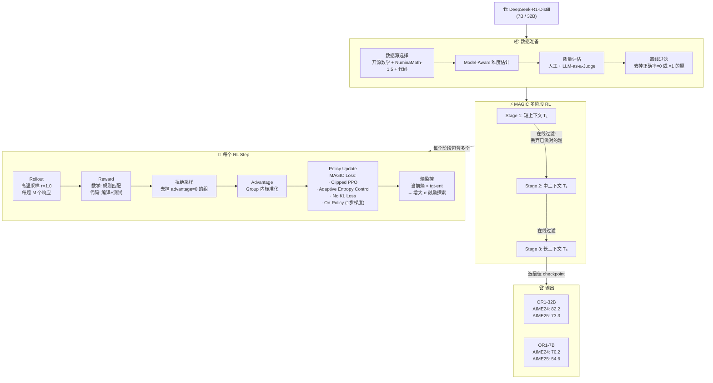

# Skywork Open Reasoner 1 (Skywork-OR1) Technical Report

> **论文链接**：https://arxiv.org/abs/2505.22312
> **机构**：昆仑万维 (Kunlun Inc.)
> **定位**：基于 DeepSeek-R1-Distill 系列，通过改进的 GRPO（MAGIC）在长 CoT 模型上做 RL，达到 SOTA
> **开源**：模型权重 + 训练代码 + 训练数据集 全部开源

---

## 1. 概述

Skywork-OR1 不是从 base model 做 RL，而是在**已有长 CoT 能力的蒸馏模型**（DeepSeek-R1-Distill）上继续 RL 训练。

核心方法叫 **MAGIC**（Multi-stage Adaptive entropy scheduling for GRPO In Convergence），是对 GRPO 的多项改进。

| 模型 | 基座 | AIME24 | AIME25 | LiveCodeBench | 提升 |
|:---:|:---:|:------:|:------:|:------------:|:---:|
| OR1-32B | R1-Distill-32B | 82.2 | 73.3 | 63.0 | +15.0% avg |
| OR1-7B | R1-Distill-7B | 70.2 | 54.6 | 47.6 | +13.9% avg |
| OR1-Math-7B | R1-Distill-7B | 69.8 | 52.3 | 43.6 | — |

> OR1-32B 超越 DeepSeek-R1 和 Qwen3-32B（数学）

---

## 2. 训练流程图

---

## 3. MAGIC：改进的 GRPO

MAGIC 在标准 GRPO 基础上做了 **六项关键改进**，分为数据、训练策略、损失函数三个维度。

### 2.1 数据层面

**离线 + 在线过滤**：
- 训练前：移除 base model 正确率为 1（全对）或 0（全错）的题
- 训练中：每个阶段开始时，丢弃 actor 在上一阶段已全部做对的题
- 效果：保证模型始终在**有挑战性的问题**上训练

**拒绝采样**：
- 过滤掉 advantage = 0 的组（全对或全错的采样组）
- 原因：这些组不贡献 policy loss，但会影响 KL/entropy loss → 训练不稳定

### 2.2 训练策略

**多阶段训练**（Multi-Stage Training）：
- 逐步增加上下文长度 T
- 显著降低计算成本，同时保持可扩展性
- 参考 DeepScaleR 的思路

**截断响应的 Advantage Mask**：
- 早期阶段很多响应被截断（长度不够）
- 实验发现：对截断响应施加负 advantage **不会**影响后续阶段
- 最终决策：**不使用** advantage mask，提升 token 效率

**高温采样**（τ = 1.0）：
- 低温（如 0.6）会导致策略立即进入低熵状态
- 高温增强探索能力，维持学习可塑性

**On-Policy 训练**：
- OR1-7B 和 OR1-32B 使用严格 on-policy（每步只做 1 次梯度更新）
- 原因：on-policy 显著减缓 entropy collapse，带来更好的测试性能
- OR1-Math-7B 用了 2 步梯度（off-policy），靠 adaptive entropy control 补救

### 2.3 损失函数

**去掉长度归一化**：
- 原始 GRPO 每个响应除以 |y_ij|
- MAGIC 去掉这一项 → token 级 policy loss，在 batch 内所有 token 上平均

**Adaptive Entropy Control（自适应熵控制）**：
- 引入超参 `tgt-ent`（目标熵）
- 动态调整熵系数 α_k：当前熵 < 目标熵 → 增大 α 鼓励探索
- 避免固定系数难以调参的问题

**去掉 KL Loss**：
- 实验发现 KL loss 在多阶段训练的后期**阻碍**性能提升
- 用 adaptive entropy control 替代 KL 的约束作用

---

## 3. Entropy Collapse 深度研究

这是本文最有价值的贡献之一：**系统研究了 RL 训练中的熵崩塌问题**。

### 什么是 Entropy Collapse？
- 策略的熵持续下降 → 模型输出越来越确定性 → 丧失探索能力
- 过早的 entropy collapse = 过度 exploitation，测试性能下降

### 关键发现

| 因素 | 影响 |
|:---:|:---:|
| Off-policy 更新（多步梯度） | 加速 entropy collapse |
| 低温采样 | 立刻进入低熵状态 |
| KL loss | 后期阻碍性能但不能有效防止 collapse |
| On-policy + 高温 | 有效减缓 collapse |
| Adaptive Entropy Control | 最有效的防御手段 |

### 核心结论
> **Premature entropy collapse generally manifests as worse performance.**
> 防止过早熵崩塌是 RL 训练取得好效果的关键。

---

## 4. 数据准备

### 数据源
- 开源数学数据集 + NuminaMath-1.5 中的难题
- 严格预处理和过滤

### Model-Aware 难度估计
- 根据当前模型的能力评估题目难度
- 动态过滤太简单/太难的题

### 质量评估
- 人工 + LLM-as-a-Judge 双重验证

---

## 5. Verifier（验证器）

### 数学验证器
- 规则化答案匹配
- 比 DeepScaleR 用的验证器更准确

### 代码沙箱
- 编译运行 + 测试用例验证
- 支持 LiveCodeBench 评估

---

## 6. 训练资源分配研究

### 固定资源下的效率优化
- 多阶段训练（短→长上下文）比直接用长上下文更高效
- 节省计算的同时不牺牲性能

### 更多资源的性能提升
- 更多的 RL 训练步数持续带来收益
- 但有边际递减

---

## 7. 关键结果

| 模型 | AIME24 | AIME25 | LiveCodeBench | 对比 |
|:---:|:------:|:------:|:------------:|:---:|
| Skywork-OR1-32B | 82.2 | 73.3 | 63.0 | 超 R1 & Qwen3-32B (数学) |
| Skywork-OR1-7B | 70.2 | 54.6 | 47.6 | 同级别竞争力强 |
| DeepSeek-R1 | 79.8 | — | — | 被 OR1-32B 超越 |
| Qwen3-32B | — | — | — | 被 OR1-32B 超越 |

---

## 8. 实战 Takeaway

1. **在蒸馏模型上做 RL 是有效的**：不一定要从 base model 开始，R1-Distill + RL 也能大幅提升
2. **Entropy collapse 是最大的坑**：务必监控训练过程中的熵变化
3. **Adaptive entropy control 比 KL loss 更好用**：动态调节，不需要精确调参
4. **高温采样（τ=1.0）**：虽然反直觉，但对保持探索至关重要
5. **On-policy 训练优于 off-policy**：每步只做 1 次梯度更新
6. **去掉 KL loss**：多阶段训练后期 KL 会拖后腿
7. **数据过滤要动态**：每个阶段过滤掉已经做对的题
8. **多阶段上下文长度递增**：省计算 + 保性能
9. **全开源**：权重 + 代码 + 数据，可直接复现

---

## 9. 与 DeepSeek-R1 的对比

| 维度 | DeepSeek-R1 | Skywork-OR1 |
|:---:|:----------:|:----------:|
| 起点 | V3-Base（需冷启动） | R1-Distill（已有CoT能力） |
| 算法 | GRPO | MAGIC（改进GRPO） |
| KL loss | 使用 | 不使用 |
| Entropy 管理 | 语言一致性 reward | Adaptive Entropy Control |
| 训练策略 | 单阶段上下文 | 多阶段递增上下文 |
| 数据过滤 | 静态 | 离线+在线动态过滤 |
| 开源程度 | 权重开源 | 权重+代码+数据全开源 |
| AIME24 | 79.8 | 82.2 (32B) |

---

## 10. 待深入问题

- 多阶段训练的具体上下文长度切分方案？
- `tgt-ent` 超参的具体值和调参策略？
- 数学验证器的具体实现细节？
- 32B 和 7B 模型的训练 GPU 资源和时间？
- NuminaMath-1.5 的数据筛选标准？
