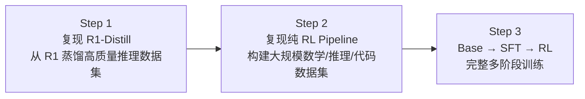

# Open-R1: A Fully Open Reproduction of DeepSeek-R1

> **来源**：https://huggingface.co/blog/open-r1
> **机构**：Hugging Face
> **代码**：https://github.com/huggingface/open-r1
> **定位**：DeepSeek-R1 的完全开源复现计划，补齐数据+代码的缺失

---

## 1. 概述

DeepSeek-R1 开源了模型权重，但**没有开源训练数据和训练代码**。Open-R1 项目的目标是补齐这些缺失的部分。

| 缺失部分 | 说明 |
|:-------:|:---:|
| 数据集 | R1 的推理数据集如何构造？未公开 |
| 训练代码 | 超参怎么选？不同模型族怎么调？未公开 |
| Scaling Laws | 训练推理模型的 compute/data trade-off？未知 |

---

## 2. DeepSeek-R1 回顾

Open-R1 博客对 R1 的训练路线做了简洁总结：

**R1-Zero**：
- 跳过 SFT，直接用 GRPO 做 RL
- 简单的 rule-based reward（准确性 + 格式）
- 模型自发学会分步推理和自我验证
- 问题：输出不可读

**R1**：
- 加了 Cold Start 阶段（少量精心构造的示例）
- 多轮 RL + Rejection Sampling
- 结合人类偏好和可验证 reward
- 输出清晰且推理能力更强

---

## 3. Open-R1 复现计划（三步走）

| 步骤 | 目标 | 产出 |
|:---:|:---:|:---:|
| Step 1 | 复现 R1-Distill | 高质量合成推理数据集 |
| Step 2 | 复现 R1-Zero 的纯 RL | 大规模数学/推理/代码数据 + RL 训练代码 |
| Step 3 | Base → SFT → RL 全流程 | 完整可复现的多阶段训练 pipeline |

---

## 4. 实战价值

**对社区的意义**：
1. **合成数据集**：任何人都可以用来 fine-tune 自己的推理模型
2. **RL 训练 recipe**：从零复现的起点
3. **文档化经验**：什么有效、什么无效、为什么

**不局限于数学**：
- 计划扩展到代码、科学（如医学）等领域

---

## 5. 实战 Takeaway

1. **R1 的核心缺失是数据和代码**，模型权重已开源
2. **蒸馏是最快的上手方式**（Step 1）：从 R1 采样生成数据 → fine-tune 小模型
3. **纯 RL 路线需要大规模数据**（Step 2）：数学/代码需要 rule-based 验证
4. **多阶段训练是终极目标**（Step 3）：但工程复杂度最高
5. **社区协作**：GitHub Issues + HuggingFace 讨论区，可以直接参与

---

## 6. 相关资源

- GitHub: https://github.com/huggingface/open-r1
- HuggingFace Hub: https://huggingface.co/open-r1
- 数据集: https://huggingface.co/collections/open-r1/open-r1-data-6782a64a754a83e30e80b681
