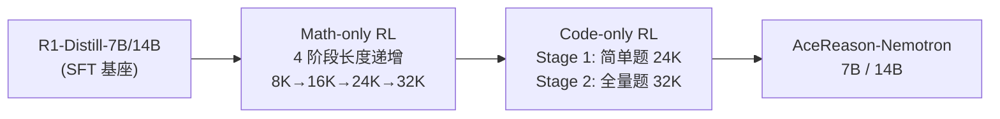

# AceReason-Nemotron: Advancing Math and Code Reasoning through RL

> **论文链接**：https://arxiv.org/abs/2505.16400
> **机构**：NVIDIA
> **模型**：https://huggingface.co/nvidia/AceReason-Nemotron-14B
> **定位**：证明 RL 在小/中模型上能超越蒸馏，数学+代码分阶段训练

---

## 1. 概述

此前 DeepSeek-R1 和 Llama-Nemotron 都认为 **小模型用蒸馏比 RL 好**。AceReason 反驳了这一点：

> 在 strong distilled model（R1-Distill-7B/14B）上做 RL，可以达到甚至超越 SOTA 蒸馏效果。

核心创新：**先做 Math-only RL，再做 Code-only RL**（分领域训练）。

| 模型 | AIME24 | AIME25 | LiveCodeBench v5 |
|:---:|:------:|:------:|:---------------:|
| R1-Distill-7B (基线) | 55.5 | 39.0 | 37.6 |
| AceReason-7B | 69.0 | 53.6 | 51.8 |
| R1-Distill-14B (基线) | 69.7 | 50.2 | 53.1 |
| AceReason-14B | 78.6 | 67.4 | 61.1 |

> 14B 模型超越 R1-Distill-32B 和 70B！

---

## 2. 训练流程

### 2.1 Math-only RL

**数据**：
- 来源：DeepScaler + NuminaMath
- 用 R1 验证：每题最多 8 次尝试，保留多数投票正确的
- 过滤太简单的题（R1 回复 < 2000 token）
- 最终 ~49,000 道高质量数学题

**训练策略**：
- 算法：GRPO（无 KL loss，无 entropy loss）
- **严格 on-policy**：每步只做 1 次梯度更新（防 entropy collapse）
- **上下文长度递增**：8K → 16K → 24K → 32K
- **课程学习**：24K/32K 阶段引入更难的题（过滤 pass rate > 6/16 的简单题）
- Batch size: 128, LR: 1e-6, G=8(8K) / G=16(其他)

**关键发现**：
> Math-only RL 不仅提升数学能力，还**显著提升代码推理能力**（+6.8% / +5.8% LiveCodeBench）！
> 这与 SFT 形成鲜明对比——Math-only SFT 会导致代码能力灾难性遗忘。

### 2.2 Code-only RL

**数据**：
- 来源：竞赛编程平台（AtCoder、LeetCode 等）
- 严格过滤：去掉多解题/交互题/需要 special judge 的题
- 精心构造测试用例：覆盖边界和极端情况
- 用 R1-671B 评估难度（0-8 级）
- 最终 8,520 道题

**训练策略**：
- Stage 1: 简单题 + 24K 长度 + 温度 0.6
- Stage 2: 全量题 + 32K 长度 + 温度 0.6→1.0（逐步增加探索）
- Batch size: 128, LR: 5e-6

**关键发现**：
> Code-only RL 提升代码能力，同时**数学几乎不掉**（+1.0% / -0.8% AIME24/25）。

---

## 3. 关键实验发现

### 3.1 On-policy 防止 Entropy Collapse
- 2 步或 4 步梯度更新 → ~100 步就 entropy collapse
- 1 步梯度更新 → 稳定训练

### 3.2 从 8K 开始比直接 16K/24K 更好
- 8K → 16K → 24K → 32K 的递增策略效果最优
- 直接从 16K 或 24K 开始 → 性能次优

### 3.3 难题驱动最大收益
- 后期阶段过滤简单题（pass rate > 6/16）→ 显著提升
- 模型已经会做的题对训练没有贡献

### 3.4 RL 拓展模型能力边界
- RL 不仅提升 pass@1（激活已有能力）
- 还提升 pass@64（**解决之前完全不会的题**）

### 3.5 跨域泛化
- Math RL → Code 能力提升（RL 学到的是通用推理能力）
- 但 Math SFT → Code 灾难性遗忘（SFT 是领域特定的）

---

## 4. 关键结果

| 模型 | AIME24 | AIME25 | MATH500 | LCB v5 | Codeforces Elo |
|:---:|:------:|:------:|:------:|:------:|:------------:|
| AceReason-7B | 69.0 | 53.6 | 94.1 | 51.8 | 1475 |
| AceReason-14B | 78.6 | 67.4 | 95.0 | 61.1 | 2024 |
| R1-Distill-32B | 72.6 | 54.9 | 94.3 | 57.2 | 1691 |
| R1-Distill-70B | 70.0 | 55.0 | 94.5 | 57.5 | 1633 |
| DeepSeek-R1-671B | 79.8 | 70.0 | 97.3 | 65.9 | 2029 |

> AceReason-14B 在 Codeforces Elo 上匹配 R1-671B（2024 vs 2029）！

---

## 5. 实战 Takeaway

1. **RL 在小模型上也能超越蒸馏**：关键是从 strong distilled model 出发
2. **数学和代码分开训练**：避免验证时间差异带来的效率问题
3. **Math RL 有跨域泛化效果**：免费提升代码能力
4. **严格 on-policy**：每步 1 次梯度更新，不要贪多
5. **上下文长度递增是标配**：8K→16K→24K→32K
6. **课程学习**：后期过滤简单题
7. **数据质量 > 数量**：49K 数学题 + 8.5K 代码题就够了
8. **Entropy/KL loss 都设为 0**：靠 on-policy + 长度递增 self-stabilize

---

## 6. 与其他工作的对比

| 维度 | DeepSeek-R1 | Skywork-OR1 | AceReason |
|:---:|:----------:|:----------:|:---------:|
| 起点 | V3-Base | R1-Distill | R1-Distill |
| 领域 | 全领域 | 数学+代码混合 | 数学→代码分阶段 |
| Entropy 管理 | 语言 reward | Adaptive Entropy | On-policy (足够) |
| KL loss | 使用 | 不使用 | 不使用 |
| 跨域发现 | 未报告 | 未报告 | Math RL→Code提升 |
| 模型规模 | 671B | 7B/32B | 7B/14B |
