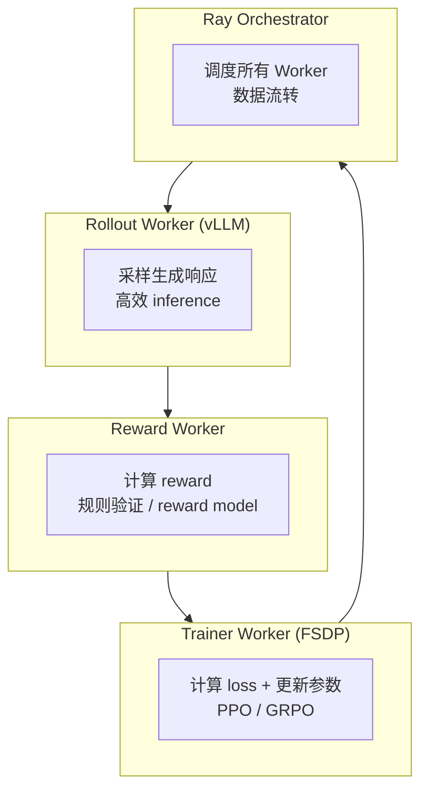

# verl 框架解析：从零开始的 RL 训练框架

> **原文**：https://zhuanlan.zhihu.com/p/30876678559
> **作者**：Nasusu（知乎 2265 赞）
> **定位**：RL 训练框架的实操指南，覆盖 verl 的设计思路和使用方法
> **框架地址**：https://github.com/volcengine/verl

---

## 1. 概述

verl（Volcano Engine Reinforcement Learning）是字节跳动开源的 LLM RL 训练框架。相比 OpenRLHF / TRL，verl 的特点是：

| 特性 | verl | OpenRLHF | TRL |
|:---:|:---:|:-------:|:---:|
| 分布式调度 | Ray-based | Ray-based | 单机为主 |
| 算法支持 | PPO / GRPO / ReMax | PPO / DPO | PPO / DPO / GRPO |
| 长序列支持 | ✅ (vLLM rollout) | ✅ | 有限 |
| 模型并行 | FSDP + vLLM | DeepSpeed / Megatron | DeepSpeed |
| 易用性 | 配置驱动 | 代码驱动 | 最简单 |

---

## 2. 核心架构

verl 的核心设计：**将 RL 训练拆分为独立的 Worker**。



### 为什么这样设计？
- **Rollout 和 Training 分离**：inference 用 vLLM（快），training 用 FSDP（灵活）
- **Ray 调度**：GPU 资源在 Rollout 和 Training 之间动态切换
- **避免显存浪费**：不需要同时加载 policy + critic + reference + reward model

---

## 3. 关键设计要点

### 3.1 Rollout（采样生成）
- 使用 vLLM 做高效推理
- 支持长序列生成（8K~32K+）
- 温度、top-p 等采样参数可配置

### 3.2 Advantage 计算
- 支持 GRPO 的 group-level 标准化
- 支持 PPO 的 GAE
- 支持多种 reward 类型（rule-based / neural）

### 3.3 Policy Update
- FSDP（Fully Sharded Data Parallel）
- 支持 gradient accumulation
- 支持 on-policy 和 off-policy

### 3.4 数据流
```
Prompt → Rollout Worker → 生成响应 → Reward Worker → 计算 reward
→ Trainer Worker → 计算 advantage + 更新参数 → 下一轮
```

---

## 4. 与其他框架的对比

### verl vs OpenRLHF
- verl 更注重大规模训练（FSDP + Ray）
- OpenRLHF 更灵活（支持 Megatron backend）
- 两者都基于 Ray 调度

### verl vs TRL
- TRL 更简单，适合入门和小规模实验
- verl 适合生产级大规模 RL 训练
- TRL 的 GRPO 实现可能不够高效

---

## 5. 使用 verl 的实战项目

| 项目 | 框架 | 说明 |
|:---:|:---:|:---:|
| Skywork-OR1 | verl | 本系列笔记 02 |
| DeepScaleR | verl | 多阶段上下文长度递增 |
| Open-Reasoner-Zero | 自定义 | PPO-based |
| AceReason | NeMo-Aligner | NVIDIA 内部框架 |

---

## 6. 实战 Takeaway

1. **选框架先看规模**：小实验用 TRL，大规模用 verl / OpenRLHF
2. **Rollout 效率是瓶颈**：~80% 训练时间花在生成上，vLLM 是标配
3. **Ray 是分布式调度的标准**：verl 和 OpenRLHF 都依赖它
4. **FSDP vs DeepSpeed**：verl 用 FSDP，OpenRLHF 用 DeepSpeed，各有优劣
5. **配置驱动**：verl 通过 yaml 配置训练，比写代码更方便

---

## 7. 相关资源

- GitHub: https://github.com/volcengine/verl
- 原文（知乎）: https://zhuanlan.zhihu.com/p/30876678559
- 官方文档: https://verl.readthedocs.io/
- OpenRLHF 对比: https://github.com/OpenRLHF/OpenRLHF
- TRL 对比: https://github.com/huggingface/trl
