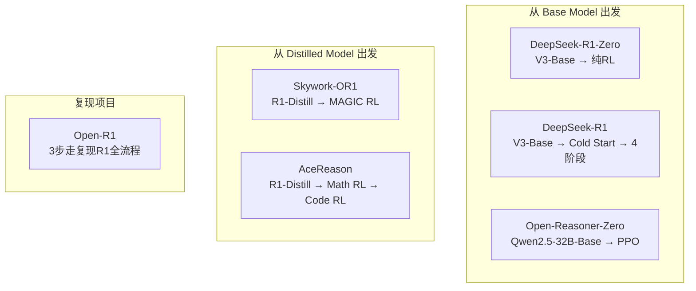

# 横向对比：Post-Training 6 篇工作

> 系统对比 DeepSeek-R1、Skywork-OR1、Open-R1、AceReason、Open-Reasoner-Zero、verl 的核心差异。

---

## 1. 训练路线对比

## 2. 算法选择对比

| 工作 | 算法 | Critic | KL Loss | Entropy 管理 |
|:---:|:---:|:-----:|:------:|:----------:|
| DeepSeek-R1 | GRPO | ❌ 无 | ✅ 使用 | 语言一致性 reward |
| Skywork-OR1 | MAGIC (改进GRPO) | ❌ 无 | ❌ 去掉 | Adaptive Entropy Control |
| AceReason | GRPO | ❌ 无 | ❌ 不使用 | On-policy 就够了 |
| Open-Reasoner-Zero | PPO + GAE | ✅ Learned Critic | ❌ 不使用 | 不需要 |

## 3. 数据策略对比

| 工作 | 数据规模 | 数据来源 | 动态过滤 |
|:---:|:------:|:------:|:------:|
| DeepSeek-R1 | 冷启动数千条 + ~800K SFT | 人工+采样 | 静态 |
| Skywork-OR1 | 开源数学+NuminaMath | 开源 | ✅ 离线+在线 |
| AceReason | 49K数学 + 8.5K代码 | DeepScaler+NuminaMath+竞赛平台 | ✅ 课程学习 |
| Open-Reasoner-Zero | 未详述 | 开源 | — |

## 4. 训练策略对比

| 策略 | R1 | OR1 | AceReason | Reasoner-Zero |
|:---:|:---:|:---:|:---------:|:------------:|
| 多阶段上下文递增 | ❌ | ✅ | ✅ (8K→32K) | ❌ |
| On-policy (1步梯度) | 未明确 | ✅ | ✅ | ✅ |
| 高温采样 | 未明确 | ✅ (τ=1.0) | 数学不用,代码递增 | 未明确 |
| 课程学习 (难度递增) | ❌ | ✅ (过滤已做对) | ✅ (过滤简单题) | ❌ |
| 分领域训练 | ❌ (混合) | ❌ (混合) | ✅ (Math→Code) | 仅数学 |

## 5. Reward 设计对比

| 工作 | 数学 Reward | 代码 Reward | 格式 Reward |
|:---:|:--------:|:--------:|:--------:|
| DeepSeek-R1 | 规则匹配 | 编译测试 | `<think>` 标签检查 |
| Skywork-OR1 | 规则匹配 | 编译测试 | — |
| AceReason | 规则匹配 (二值) | 全量测试用例 (二值) | — |
| Open-Reasoner-Zero | 规则匹配 | — | — |

## 6. 关键发现对比

| 发现 | 谁提出 | 重要性 |
|:------|:------|:------:|
| 纯 RL 涌现推理（Aha Moment） | R1-Zero | ⭐⭐⭐ |
| 冷启动加速收敛 | R1 | ⭐⭐⭐ |
| Entropy collapse 是核心风险 | OR1 | ⭐⭐⭐ |
| KL loss 在后期阻碍性能 | OR1 | ⭐⭐ |
| Math RL 跨域提升 Code | AceReason | ⭐⭐⭐ |
| RL 在小模型也能超越蒸馏 | AceReason | ⭐⭐⭐ |
| PPO Critic 抑制重复模式 | Reasoner-Zero | ⭐⭐ |
| 1/10 步数复现 R1-Zero | Reasoner-Zero | ⭐⭐ |
| 蒸馏 > 小模型直接 RL | R1 (被AceReason反驳) | ⭐⭐ |

## 7. 开源程度对比

| 工作 | 权重 | 训练代码 | 训练数据 | 可复现性 |
|:---:|:---:|:------:|:------:|:------:|
| DeepSeek-R1 | ✅ | ❌ | ❌ | 🔶 中 |
| Skywork-OR1 | ✅ | ✅ | ✅ | 🟢 高 |
| Open-R1 | ✅ | ✅ | ✅ | 🟢 高 |
| AceReason | ✅ | ❌ | 计划开源 | 🔶 中 |
| Open-Reasoner-Zero | ✅ | ✅ | ✅ | 🟢 高 |

## 8. 如果你要动手：选哪条路？

| 场景 | 推荐方案 | 原因 |
|:------|:---------|:------|
| 快速上手，资源有限 | Open-R1 Step1 (蒸馏) | 最简单，只需 SFT |
| 复现 R1-Zero 的 scaling | Open-Reasoner-Zero | 代码全开源，PPO 极简 |
| 在蒸馏模型上提升 | AceReason 路线 | Math→Code 分阶段，效果好 |
| 追求 SOTA (32B) | Skywork-OR1 MAGIC | 全开源，ablation 最详细 |
| 生产级部署 | verl / OpenRLHF | 框架成熟，支持大规模 |
