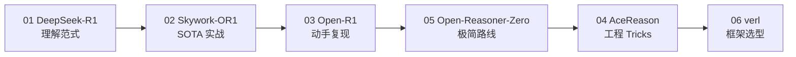

# 🧠 Post-Training 技术笔记

> 大模型后训练（Post-Training）方向的深度技术笔记，聚焦 RL for Reasoning。
> 覆盖 GRPO / PPO / DPO 等算法、训练 pipeline、数据构造、工程实践。

## 📖 项目介绍

随着 DeepSeek-R1 的发布，**强化学习驱动的推理能力训练**成为 LLM 后训练的核心范式。本仓库系统梳理了该方向的 7 篇代表性工作，从算法原理到工程实践、数据构造，形成完整的知识体系。

```
后训练全景：

Pre-trained LLM
    │
    ├── SFT (Supervised Fine-Tuning)     ← 传统路线
    │
    ├── RL on Base Model                 ← R1-Zero / Open-Reasoner-Zero
    │
    ├── Cold Start + Multi-stage RL      ← DeepSeek-R1 四阶段
    │
    └── RL on Distilled Model            ← Skywork-OR1 / AceReason
```

## 📂 笔记列表

| # | 标题 | 机构 | 核心贡献 | 来源 |
|:---:|:------|:------|:---------|:---:|
| 01 | [DeepSeek-R1](01-deepseek-r1-tech-report.md) | DeepSeek | GRPO 算法 + 四阶段 Pipeline + 蒸馏 | [arXiv](https://arxiv.org/abs/2501.12948) |
| 02 | [Skywork-OR1](02-skywork-open-reasoner.md) | 昆仑万维 | MAGIC 框架 + Entropy Collapse 研究 | [arXiv](https://arxiv.org/abs/2505.22312) |
| 03 | [Open-R1](03-open-r1.md) | HuggingFace | R1 完全开源复现计划 | [Blog](https://huggingface.co/blog/open-r1) |
| 04 | [AceReason-Nemotron](04-acereason-nemotron.md) | NVIDIA | Math→Code 分阶段 RL + 跨域泛化 | [arXiv](https://arxiv.org/abs/2505.16400) |
| 05 | [Open-Reasoner-Zero](05-open-reasoner-zero.md) | 社区 | 极简 PPO 路线，1/10 步数复现 R1-Zero | [arXiv](https://arxiv.org/abs/2503.24290) |
| 06 | [verl 框架](06-verl-framework.md) | 字节跳动 | RL 训练框架选型与实操 | [GitHub](https://github.com/volcengine/verl) |
| 07 | [Llama-Nemotron 数据集](07-llama-nemotron-post-training-dataset.md) | NVIDIA | 3300万样本后训练数据集 + 完整工具链 | [Blog](https://developer.nvidia.cn/blog/build-custom-reasoning-models-with-advanced-open-post-training-datasets/) |
| 08 | [CoPaw + AgentScope 生态](08-copaw-agentscope-ecosystem.md) | 阿里 AgentScope | Python Agent 框架全景（CoPaw/AgentScope/Runtime/ReMe） | [GitHub](https://github.com/agentscope-ai/CoPaw) |
| 10 | [Self-Rewarding LMs 系列](10-self-rewarding-language-models.md) | Meta / Apple | 自我奖励对齐（SRLM + CREAM + Apple SRLM） | [arXiv](https://arxiv.org/abs/2401.10020) |
| 11 | [Google TurboQuant](11-google-turboquant.md) | Google Research & DeepMind | 在线向量量化：KV Cache 6x 压缩 + 8x 加速 | [arXiv](https://arxiv.org/abs/2504.19874) |
| 12 | [AutoResearch 生态](12-autoresearch-ecosystem.md) | Karpathy / aiming-lab 等 | AI 自主研究与优化循环 | [GitHub](https://github.com/karpathy/autoresearch) |
| — | [横向对比](comparison.md) | — | 各工作的系统对比分析 | — |

## 🗺️ 阅读路线



**入门路线**：01 → 03 → 06（理解范式 → 复现方案 → 框架选型）

**深入路线**：01 → 02 → 04 → 05（四篇 Tech Report 逐篇精读）

**速查路线**：直接看 [横向对比](comparison.md)

## 🔑 核心结论速览

| 结论 | 来源 |
|:------|:---:|
| 纯 RL 可以在 base model 上涌现推理能力 | R1-Zero |
| 冷启动数据（数千条）显著加速 RL 收敛 | R1 |
| 规则 reward > 神经网络 reward（大规模 RL 下） | R1 |
| 蒸馏模型上继续 RL 也能大幅提升 | OR1 / AceReason |
| Entropy collapse 是 RL 训练最大的坑 | OR1 |
| 去掉 KL loss + Adaptive Entropy Control 更好 | OR1 |
| Math RL 意外提升代码能力（跨域泛化） | AceReason |
| PPO 可能比 GRPO 更稳定（learned critic） | Open-Reasoner-Zero |
| On-policy（1步梯度）是防 collapse 的标配 | OR1 / AceReason |
| 上下文长度递增是标配策略 | OR1 / AceReason |

## 📊 模型性能对比

| 模型 | 参数量 | AIME24 | AIME25 | LiveCodeBench |
|:------|:------:|:------:|:------:|:------------:|
| DeepSeek-R1 | 671B | 79.8 | 70.0 | 65.9 |
| Skywork-OR1-32B | 32B | 82.2 | 73.3 | 63.0 |
| AceReason-14B | 14B | 78.6 | 67.4 | 61.1 |
| Skywork-OR1-7B | 7B | 70.2 | 54.6 | 47.6 |
| AceReason-7B | 7B | 69.0 | 53.6 | 51.8 |

## 🛠️ 相关开源资源

| 资源 | 链接 |
|:------|:------|
| DeepSeek-R1 权重 | https://huggingface.co/deepseek-ai/DeepSeek-R1 |
| Skywork-OR1 (权重+代码+数据) | https://huggingface.co/Skywork |
| Open-R1 项目 | https://github.com/huggingface/open-r1 |
| AceReason-Nemotron | https://huggingface.co/nvidia/AceReason-Nemotron-14B |
| Open-Reasoner-Zero | https://github.com/Open-Reasoner-Zero/Open-Reasoner-Zero |
| Llama-Nemotron 后训练数据集 | https://huggingface.co/datasets/nvidia/Llama-Nemotron-Post-Training-Dataset |
| NeMo-Skills（数学/代码数据管护） | https://github.com/NVIDIA-NeMo/Skills |
| NeMo-Curator（通用数据管护） | https://github.com/NVIDIA-NeMo/Curator |
| verl 框架 | https://github.com/volcengine/verl |
| OpenRLHF 框架 | https://github.com/OpenRLHF/OpenRLHF |
| TRL 框架 | https://github.com/huggingface/trl |

## 📝 License

MIT
